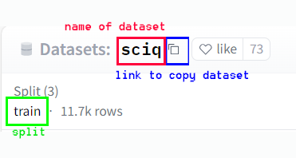

# Creating LlamaIndex EmbeddingQAFinetuneDataset compatible inputs
<p align = "center">
  
</p>

## Introduction
An important lever to improve RAG performance is to finetune the embeddings model itself.

The embeddings model is used to tokenize and "embed" the input text into the vectorstore. Hence, the better your embeddings model aligns to the data and terminology of your domain, the better the RAG will be in extracting the correct documents to be passed to your LLM model. 

LlamaIndex provides a robust library called <a href="https://docs.llamaindex.ai/en/stable/optimizing/fine-tuning/fine-tuning.html"><b>llama_index.finetuning</b></a> to accomplish this. To use this library, we have to instantiate a <a href="https://github.com/run-llama/llama_index/blob/main/llama-index-finetuning/llama_index/finetuning/embeddings/common.py">EmbeddingQAFinetuneDataset</a> object from our data. One way to instantiate this object is using a JSON file in a specific format.

The data in the JSON file is typically a question-answer dataset or a question-reference dataset (where the answer is not explicitly provided but the reference data in which the answer resides is provided. This is an even more powerful paradigm for RAG models since it is the basis on which they work). All guides <a href="https://docs.llamaindex.ai/en/stable/examples/finetuning/embeddings/finetune_embedding.html">(including the llamaindex documentation)</a> create this data (question - reference sets from a link or html content using generate_qa_embedding_pairs() i.e. the input is a text file of all the relevant content and the LLM itself creates question-reference datasets. <br>
However, <b>this is not suitable for a couple of reasons:</b>
<li>Generate_qa_embedding_pairs() uses an LLM to create these question - reference sets. This may be either:
  <ul>
 <li>Expensive (OpenAI or Cohere) or computationally intensive (multi-billion parameter open source models) for large amounts of content e.g. 50K pages in Wikipedia</li>
<li>May not necessarily be coherent question - reference sets depending on the complexity of the model or the nuance in the data </li></ul></li>
<li>There are several open source datasets on HuggingFace which may be both nuanced and relevant to the domain we are targetting. Not leveraging this data would be a massive opportunity loss
</li>
</ol>
Hence, this repo seeks to leverage external question-answer and question-reference datasets already available on <a href="https://huggingface.co/docs/datasets/index">Huggingface</a> or any other data. The repo takes as input,  a simple dictionary or a json file, in a pre-defined format containing question / answers or question / reference details and transforms it into a EmbeddingQAFinetuneDataset-compatible json file that can, as a downstream activity, be used to finetune your embedding model.

## Usage
1. In the main.py file, review the create_dataset() function to understand the structure of the file that needs to be provided as an input.
2. Create your json input file in the format as in create_dataset(). You can also refer to the <a href="https://github.com/SwamiKannan/Creating-Llamaindex-EmbeddingQAFinetuneDataset-compatible-files/tree/main?tab=readme-ov-file#json-template">structure below in the "JSON template" section </a>
3. Run the following from a command prompt:
   
   ```
   python main.py <filename>
   ```
5. The code also prints out the number of items in your json file to confirm processing.

### Addendum
Added code to create the json file referred to in step 1 and 2 above. <b> You do not have to mandatorily use this code. Rather, you can create your own json file as per the template structure mentioned below. </b>
#### 1. Using a HuggingFace dataset for finetuning
* Write a transform function that will create the columns 'question' and 'answer' in your dataset (as a Pandas dataframe). Illustratively, this will look like:
      
          def transform_data(df):
              df['question'] = <command to process data that gives us the text for your question>
              df['answer'] = < command to process data that gives us the text for your response / answer / context>

* Create a HFJSONCreator object:<br>
    
          from process_data import HFJSONCreator
          hfjsonobject = HFJSONCreator(source, transform_df, split='validation', test_ratio=0, to_disk=True)
  where:<br>
      <ul>
      <li> source is the dataset link as shown below: </li>
      <li> transform_fn is the name of the function defined in the step above  </li>
      <li> split is the split you want ('train', 'test', 'validation', etc.) </li>
      <li> test_ratio - if you want to split the dataset into train and test, state the ratio of the test set else set to 0 </li>
      <li> to_disk - If you want to save the dataset to the local drive</li>
       </ul>
      <center><sub><b> Refer to the image below for parameters 'source' and 'split' </b></sub></center><br>
  <div style="text-align: center;">
    
  
  
   </div>

* Run the following lines of code to create and write the json file to disk

           sciq_test_json.create_all_dicts()
           sciq_test_json.write_dict()

* Save all this code in a file <name>.py in the src folder
* On running this code: <br>
      <ul>
        <li> The final json file will be created in <b> <root>/processed_data/templated_json </b></li>
        <li> If<b> to_disk</b> is <b>True</b>, the dataset will be saved in <b><root>/datasets </b></li>
      </ul>
#### 2. Using your own local data for finetuning
* Write a data loader function. This function has to load the data into a dataframe.<br>
      e.g. if the base file is a csv, then you will have to load the data to a dataframe using pd.read_csv()<br>
      e.g. if the base file is an Excel file, then you will have to load the data to a dataframe using pd.read_excel()<br>
      <b> Ensure that this function returns a pandas dataframe </b>
      
* Write a transform function that will create the columns 'question' and 'answer' in your dataset (as a Pandas dataframe). Illustratively, this will look like:
      
          def transform_data(df):
              df['question'] = <code to process data that gives us the text for your question>
              df['answer'] = < code to process data that gives us the text for your response / answer / context>
    
* Create a LocalJSONCreator object:<br>
    
          from process_data import LocalJSONCreator
          hfjsonobject = LocalJSONCreator(data_path_name, load_data_fn, transform_data, split='train', test_ratio=0)
  where:<br>
      <ul>
      <li> data_path_name </li>
      <li> load_data_fn is the name of the data loader function that was created above </li>
      <li> transform_data is the name of the function defined in the step above  </li>
      <li> split is the split you want ('train', 'test', 'validation', etc.) </li>
      <li> test_ratio - if you want to split the dataset into train and test, state the ratio of the test set else set to 0 </li>
       </ul>

* Run the following lines of code to create and write the json file to disk

           sciq_test_json.create_all_dicts()
           sciq_test_json.write_dict()

* Save all this code in a file <name>.py in the src folder
* On running this code: <br>
      <ul>
        <li> The final json file will be created in <b> <root>/processed_data/templated_json </b></li>
        <li> If<b> to_disk</b> is <b>True</b>, the dataset will be saved in <b><root>/datasets </b></li>
      </ul>

### JSON template


## Image credits:
 <b>Image credit: </b>Base Image  for cover generated using <a href="https://www.segmind.com/models/sdxl1.0-txt2img">Segmind's Stable Diffusion XL 1.0 model</a>. Additional image editing by me. <br>
 <b>Prompt: </b>cinematic film still, 4k, realistic, of a man casting spells on documents, Fujifilm XT3, long shot, ((low light:1.4)), landscape , very wide angle shot, somber, vignette, highly detailed, high budget Hollywood movie, bokeh, cinemascope, moody, epic, neon, gorgeous, film grain, grainy
</sub>
